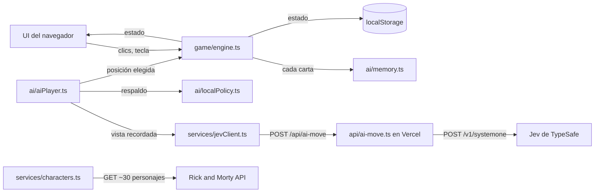

<!-- Copia en español. La versión canónica es spec.md (inglés). -->

# MemorIA — Especificación técnica

## Cómo funciona, en lenguaje simple

MemorIA es una página web hecha con **Vite + TypeScript**. Casi todo corre en el navegador del jugador: el tablero, los turnos, los dados, el marcador y la **memoria imperfecta** de la IA.

La IA rival tiene dos mitades:

1. **La memoria (código nuestro, el núcleo).** Cada vez que se da vuelta cualquier carta, la IA la "ve", pero solo la *recuerda* con una probabilidad que depende del nivel: baja en el nivel 1, casi segura en el nivel 5. Es TypeScript común con un generador de números aleatorios con semilla, así que se puede testear y reproducir exactamente.
2. **La decisión (Jev).** En su turno, la IA le manda a **Jev** (un modelo de IA de decisiones tipadas de TypeSafe) **solo lo que recuerda** más la lista de posiciones boca abajo, y le pregunta: "¿qué carta doy vuelta?". Jev responde con una posición, una probabilidad por opción y un puntaje de confianza. Jev nunca ve el tablero real, así que no puede hacer trampa: una memoria olvidadiza de nivel 1 sigue dando una IA olvidadiza de nivel 1.

Jev necesita una API key secreta, y un secreto no puede vivir en una página del navegador (cualquiera podría leerlo). Por eso hay una **función de servidor** chiquita en Vercel (`api/ai-move.ts`) que guarda la key, le reenvía la pregunta a Jev y devuelve la respuesta. Si Jev tarda, falla, responde algo inválido o no está seguro, un **jugador local de reglas** elige la jugada, así la partida nunca se traba.

Las imágenes de las cartas llegan en vivo desde la **Rick and Morty API**: una sola petición trae un grupo curado de unos 30 personajes. Cada nivel sortea sus personajes de ese grupo (una partida nueva o un reinicio usan una semilla nueva, así que las caras van variando), y el navegador precarga las imágenes de ese nivel y las dibuja pixeladas. Si esa API no responde, las cartas pasan a ser cartas retro con número y color, y el juego sigue siendo jugable.

El progreso se guarda en el `localStorage` del navegador (un anotador que el navegador guarda para este sitio) después de cada jugada, así que cerrar y volver a abrir la pestaña restaura el tablero exacto.

Por qué esta forma: una página, una función chiquita, dos servicios externos, sin base de datos ni cuentas. Es el sistema más chico que prueba el núcleo (una memoria que mejora nivel a nivel) usando un modelo de IA real para las decisiones.

## El recorrido principal a través del sistema

Ref. PRD: `prd.md > The Core Journey`.

1. **Abre la página** → `main.ts` carga lo guardado desde `localStorage` (`services/storage.ts`) y, en paralelo, trae el grupo de personajes (`services/characters.ts`) en una sola petición.
2. **Sin partida guardada** → el modal de bienvenida (`ui/modals.ts`) pide el nombre. **Con partida guardada** → salta directo a la fase guardada con el tablero exacto.
3. **Empieza el nivel** → `game/deck.ts` sortea los personajes del nivel entre los del grupo, arma las cartas (cada personaje dos veces) y las mezcla con el RNG con semilla. `characters.ts` precarga esas imágenes con `Promise.allSettled`. El tablero se dibuja boca abajo (`ui/board.ts`).
4. **Dados** → el jugador aprieta Espacio/Enter (o toca). `game/dice.ts` tira los dos dados y, si empatan, el jugador vuelve a tirar. El número más alto empieza.
5. **Turno del jugador** → los clics van a `game/engine.ts`, que da vuelta las cartas, revisa el par, manda los pares acertados a la columna del jugador o arranca el temporizador del par fallado (de 5 s a 3 s según el nivel). Cada carta que se da vuelta también se le informa a `ai/memory.ts`, que decide si la IA la recuerda.
6. **Turno de la IA** → `ai/aiPlayer.ts` arma la vista de "lo que recuerdo", le pide a `services/jevClient.ts` (→ `/api/ai-move` → Jev) la primera carta, la da vuelta y vuelve a preguntar por la segunda. Cada respuesta se valida. Si falla, decide el jugador local de reglas (`ai/localPolicy.ts`). La manito (`ui/hand.ts`) se mueve hasta cada carta elegida antes de darla vuelta. Durante esta fase se ignoran los clics en el tablero.
7. **Después de cada cambio** → el motor emite el nuevo estado, la UI se vuelve a dibujar y `storage.ts` lo guarda.
8. **Termina el nivel** (no quedan cartas) → el motor compara los pares, actualiza el marcador de niveles (el empate no suma) y la capa superpuesta muestra victoria, derrota o empate. Después arranca el nivel siguiente.
9. **Después del nivel 5** → la capa muestra el trofeo con confeti, el robot con el trofeo o el mensaje de empate (`ui/effects.ts`). Reiniciar vuelve al nivel 1, 0–0, con el mismo nombre y una semilla nueva, así que cambian los personajes.
10. **Cierra y vuelve** → el paso 1 restaura el estado guardado. Las cartas sin par que estaban boca arriba vuelven a quedar boca abajo, el turno sigue siendo del mismo jugador y los dados ya tirados no se vuelven a tirar.



## Stack

| Pieza | Elección | Docs |
|---|---|---|
| Lenguaje | TypeScript (strict) | https://www.typescriptlang.org/docs/ |
| Build/servidor de desarrollo | Vite, plantilla vanilla TS (sin framework de UI) | https://vite.dev/guide/ |
| Tests | Vitest | https://vitest.dev/guide/ |
| Decisiones de la IA | Jev vía `@typesafe-ai/sdk` (solo del lado del servidor, Node 20+) | https://docs.typesafe.ai/ · https://docs.typesafe.ai/sdk/javascript |
| Función de servidor + hosting | Vercel Functions (carpeta `api/`), `vercel dev` en local | https://vercel.com/docs/functions · https://vercel.com/docs/cli/dev |
| Imágenes de las cartas | Rick and Morty API | https://rickandmortyapi.com/documentation |
| Confeti | `canvas-confetti` | https://github.com/catdad/canvas-confetti |
| Tipografía | "Press Start 2P" (Google Fonts), monospace de respaldo | https://fonts.google.com/specimen/Press+Start+2P |

- **Vite + TypeScript**: elección del autor. Sin framework de UI: la interfaz es un tablero, dos columnas y algunos modales, y alcanza con dibujar el DOM directamente a partir de un único objeto de estado.
- **Vitest en lugar de Jest**: recomendación aceptada. Misma API `describe/it/expect`, reutiliza la config de Vite y entiende TS sin configuración extra.
- **Jev para las jugadas de la IA**: elección del autor, para trabajar con un modelo de IA real y hacer concreta la confiabilidad (confianza + respaldo). Lo que se acepta a cambio: una función de servidor chiquita, una llamada de red por cada carta que elige la IA y un cambio en el PRD (la IA ya no es solo reglas).
- **Vercel**: recomendación aceptada, porque el mismo `api/ai-move.ts` corre en local y en producción, y da un link público.
- **Sin verificar, revisar en el primer paso del build:** las versiones mayores de Vite y Vitest al momento de instalar; que la cuenta de TypeSafe del autor tenga una API key activa y créditos; la latencia de Jev por llamada; que el preset de Vite en Vercel tome la carpeta `api/` como se espera.

## Dónde corre y cómo lo prueba alguien

- **Entorno:** navegador (escritorio, tablet, celular) más una función serverless con Node 20+.
- **Requisitos:** Node.js 20+, npm, Vercel CLI (`npm i -g vercel`), una API key de TypeSafe.
- **Secretos:** `TYPESAFE_API_KEY` en `.env.local` (ignorado por git; `.env.example` se commitea vacío) y en las variables de entorno del proyecto en Vercel.
- **Correr en local con Jev (para grabar el demo):**
  ```
  npm install
  cp .env.example .env.local   # pegar la key de TypeSafe
  vercel dev                   # → http://localhost:3000
  ```
- **Correr solo la UI (sin key):** `npm run dev` → http://localhost:5173. Ahí `/api/ai-move` no existe, así que la IA usa automáticamente el jugador local de reglas. El indicador del cerebro de la IA muestra "Rules".
- **Forzar el jugador de reglas en cualquier lado:** agregar `?ai=local` a la URL (útil para testear y como red de seguridad en el demo).
- **Tests:** `npm test` (Vitest, sin red: Jev y la Rick and Morty API se simulan).
- **Entrega:** video demo de 1 a 3 minutos (tramos acelerados, niveles 1 → 5) y el repo público de GitHub con `devpost/scope.md`, `prd.md` y `spec.md`.
- **Deploy opcional (elegido):** Vercel, lo hace el autor en `6-ship` (`vercel` → preview, `vercel --prod` → link público, después de cargar `TYPESAFE_API_KEY` en el panel de Vercel).

## Aspecto visual

Continúa `prd.md > Look and Feel`, con personajes de Rick and Morty en lugar de los pictogramas de ARASAAC.

- **Clima:** videojuego pixelado de los 90, colorido y luminoso, con un toque de ciencia ficción y portales.
- **Paleta (variables CSS):** fondo de página amarillo pálido `#fff4b8` con texto azul marino `#1b2150` (cambiado en la revisión del slice 1), espacio profundo `#0b0f2a` y panel `#1b2150` para cartas y paneles, verde portal `#97ce4c` (principal, color del jugador), cian `#44d9e6` (color de la IA), amarillo `#ffd23f` (trofeo, destacados), magenta `#ff4f9a` (derrota/alertas), texto blanco roto `#f4f4f4`.
- **Tipografía:** "Press Start 2P" para todo, en tamaños chicos y con buen espaciado entre letras. El logo dice **MemorIA** con "IA" en verde portal.
- **Pixelado:** cada imagen de 300×300 se achica a un canvas de 64×64 (32×32 quedaba demasiado pixelado en la revisión del slice 1) y se agranda con `image-rendering: pixelated`. Bordes gruesos de 4px, sombras duras, sin esquinas redondeadas ni degradados suaves.
- **Dorso de las cartas:** un remolino de portal pixelado en verde (CSS o SVG inline).
- **Cartas de respaldo:** un número grande pixelado sobre un color sólido de la paleta, del mismo tamaño que una carta.
- **Detalles distintivos:** manito pixelada (SVG inline) que se desliza hasta la carta que da vuelta la IA; trofeo amarillo girando (rotación CSS 3D) con `canvas-confetti`; robot pixelado sosteniendo el trofeo (SVG inline).
- **Movimiento:** vueltas rápidas de 150 a 250 ms; la manito de la IA tarda unos 600 ms por jugada para que quien mira pueda seguirla.
- **Textos:** todos en inglés, cortos y juguetones ("Your turn!", "The AI found a pair!", "Level 3 — AI memory: sharper").
- **Pie de página con créditos:** "Character images from The Rick and Morty API (rickandmortyapi.com). Rick and Morty © Adult Swim / Warner Bros. Discovery. Non-commercial fan project."

## Componentes

### Motor del juego (`game/engine.ts`)
Una máquina de estados pura: `(estado, acción) → nuevoEstado`, sin DOM, sin temporizadores y sin red. Acciones: `setName`, `rollDice`, `flip(position, by)`, `hideMismatch`, `nextLevel`, `restart`. Hace cumplir las reglas: solo el jugador activo da vuelta cartas, un par acertado va a la columna de quien lo encontró y esa persona sigue jugando, un par fallado pasa el turno después del tiempo de muestra, y los empates se resuelven con las reglas de puntaje.
Fases: `welcome → dice → playerTurn | aiTurn → revealMismatch → levelEnd → gameOver`.
Ref. PRD: `prd.md > Turns and Pairs`, `prd.md > Level Scoreboard and End of Game`, `prd.md > States and Boundaries`.

### Niveles (`game/levels.ts`)
La tabla de niveles como datos: cartas, pares, tiempo de muestra, probabilidad de memoria de la IA y columnas del tablero (escritorio/celular).
Ref. PRD: `prd.md > Levels`.

| Nivel | Cartas | Tiempo de muestra | Probabilidad de recordar de la IA | Grilla escritorio | Grilla celular |
|---|---|---|---|---|---|
| 1 | 12 | 5 s | 0,20 | 4×3 | 4×3 |
| 2 | 16 | 4,5 s | 0,40 | 4×4 | 4×4 |
| 3 | 20 | 4 s | 0,60 | 5×4 | 4×5 |
| 4 | 24 | 3,5 s | 0,80 | 6×4 | 4×6 |
| 5 | 28 | 3 s | 0,95 | 7×4 | 4×7 |

Las probabilidades son una propuesta inicial que se ajusta durante el build con el test del núcleo (ver **Verificación**). Las grillas de escritorio de los niveles 1 y 2 pasaron de 6×2 / 8×2 a 4×3 / 4×4 en la revisión del slice 2.

### Mazo y RNG (`game/deck.ts`, `game/rng.ts`)
`rng.ts` es un generador chico con semilla (mulberry32). Su semilla y su estado interno viven en el estado del juego, así que al recargar sigue la misma secuencia. Una partida nueva o un reinicio reciben una semilla nueva (`crypto.getRandomValues`). `deck.ts` sortea N personajes distintos del grupo para el nivel (N = pares), los duplica y los mezcla con Fisher–Yates usando el RNG. Si cargaron menos personajes de los necesarios, las cartas de respaldo completan lo que falta.
Ref. PRD: `prd.md > Levels` ("each character appears exactly twice, shuffled"; "characters vary between games").

### Dados (`game/dice.ts`)
Una tirada por cada vez que se aprieta: de 1 a 6 para los dos jugadores con el RNG. Si empatan, la fase sigue en `dice` y el jugador vuelve a tirar apretando otra vez (cambiado en la revisión del slice 2 para dar más participación). Cada tirada queda en `dice.rolls`; `starter` se define en la primera que no es empate.
Ref. PRD: `prd.md > Dice Roll`.

### Memoria de la IA: el núcleo (`ai/memory.ts`)
`observe(position, characterId, level, rng)`: cuando se da vuelta cualquier carta, la IA recuerda `{posición → characterId}` con la probabilidad del nivel; si no, no la guarda. Las cartas ya emparejadas se borran de la memoria. La memoria forma parte del estado guardado.
Ref. PRD: `prd.md > The Game AI (the Kernel)`; `scope.md > The Unique Kernel`.

### Jugador local de reglas (`ai/localPolicy.ts`)
Una política determinística (dado el RNG) que usa la misma vista recordada: (1) segunda carta: si recuerda la pareja de la primera, la da vuelta; (2) primera carta: si recuerda un par completo, da vuelta una de sus cartas; (3) si no, da vuelta al azar una carta boca abajo que no recuerda. Es a la vez el respaldo y la base de comparación del test del núcleo.
Ref. PRD: `prd.md > The Game AI (the Kernel)`.

### Jugador IA (`ai/aiPlayer.ts`)
Organiza cada elección de la IA. Arma la vista (posiciones boca abajo, cuáles recuerda y como qué personaje, y la primera carta si ya la eligió) y llama a Jev a través de `jevClient`. Acepta la respuesta solo si la posición está boca abajo, no fue elegida ya en este turno y la confianza es ≥ 0,5. Si no, usa `localPolicy`. Registra `source: "jev" | "rules"` y la confianza para el indicador del cerebro de la IA. Con `?ai=local` se saltea Jev.
Ref. PRD: `prd.md > The Game AI (the Kernel)`, `prd.md > Turns and Pairs`.

### Cliente de Jev (`services/jevClient.ts`)
`POST /api/ai-move` con un timeout de 3 s (`AbortController`). Devuelve `{ position, confidence }` o lanza un error, que el Jugador IA atrapa para pasar al respaldo.

### Función de servidor (`api/ai-move.ts`)
Una función de Vercel que valida el cuerpo de la petición, lo convierte en una pregunta `choice` de Jev, llama a `client.systemOne` y devuelve la posición elegida y la confianza. Lee `TYPESAFE_API_KEY` del entorno. El armado de la pregunta es una función pura exportada, así Vitest la puede testear sin red. El contrato está en **Servicios externos**.

### Personajes (`services/characters.ts`)
Tiene el grupo curado de unos 30 IDs de personajes, los trae en una sola petición al cargar la página y, cuando empieza un nivel, precarga las imágenes de ese nivel con `Promise.allSettled`. Devuelve `{ id, name, image | null }` por cada personaje; `null` significa carta de respaldo. No se guarda nada en el repo ni en `localStorage` salvo los IDs.
Ref. PRD: `prd.md > Look and Feel`.

### Almacenamiento (`services/storage.ts`)
Guarda el estado completo como JSON bajo `memoria:save:v1` después de cada cambio. Al cargar, revisa la versión y la forma; si está corrupto o es de una versión vieja, arranca de cero. Cada lectura y escritura va dentro de un try/catch (el modo privado puede bloquear el almacenamiento).
Ref. PRD: `prd.md > Resume Where You Left Off`.

### UI (`ui/`)
Dibuja a partir del estado; no contiene reglas del juego.
- `modals.ts`: bienvenida (nombre obligatorio más instrucciones), modal de detalles del jugador en celular y capas de resultado. Ref. PRD: `prd.md > Welcome and Instructions`, `prd.md > Screens and Layout`.
- `board.ts`: la grilla, la animación de vuelta y el manejo de clics/toques (se ignoran si no es el turno del jugador). Usa `pixelate.ts` para dibujar las caras.
- `columns.ts`: las columnas del jugador y la IA (nombre, pares de este nivel, niveles ganados), el indicador de nivel, el marcador de niveles y el indicador del cerebro de la IA ("AI brain: Jev 82%" o "AI brain: Rules"). En celular: nombres y niveles ganados arriba, y un toque abre los detalles.
- `dice.ts`: dos dados 3D con puntos; Espacio/Enter/toque para tirar. Cada tirada gira y frena durante `DICE_ROLL_MS` (3 s) antes de aplicar el resultado, y las tiradas empatadas se muestran (agregado en la revisión del slice 2). El motor decide el resultado al instante; solo la UI espera.
- `hand.ts`: el indicador de turno; en el turno de la IA se desliza hasta cada carta elegida antes de darla vuelta.
- `effects.ts`: trofeo con confeti, robot con el trofeo y mensaje de empate.
- `pixelate.ts`: imagen → canvas de 64×64 → agrandada, o la carta de respaldo.

### Temporizadores y ciclo de turnos (`main.ts`)
El único lugar con `setTimeout`. Arranca el temporizador del par fallado (tiempo de muestra → `hideMismatch`), ejecuta el turno de la IA paso a paso (pensar → mover la manito → dar vuelta → repetir) y conecta motor → dibujo → guardado. Dejar los temporizadores fuera del motor hace que el motor se pueda testear.

## Modelo de datos

```ts
type Player = "human" | "ai";

interface Card { position: number; characterId: number; state: "down" | "up" | "matched"; matchedBy?: Player }

interface GameState {
  version: 1;
  phase: "welcome" | "dice" | "playerTurn" | "aiTurn" | "revealMismatch" | "levelEnd" | "gameOver";
  name: string;
  level: 1 | 2 | 3 | 4 | 5;
  cards: Card[];
  flipped: number[];                     // posiciones boca arriba en este turno (0–2)
  pairs: { human: number[]; ai: number[] };  // characterIds juntados en este nivel
  levelWins: { human: number; ai: number };
  lastLevelResult?: Player | "tie";
  dice?: { rolls: Array<{ human: number; ai: number }>; starter: Player };
  turn: Player;
  aiMemory: Record<number, number>;      // posición → characterId que la IA recuerda
  rng: { seed: number; state: number };
}
```

| Dato | Dónde vive | Cuándo se actualiza | Al irse y volver |
|---|---|---|---|
| `GameState` completo | memoria + `localStorage` (`memoria:save:v1`) | después de cada acción del motor | se restaura exacto; las cartas de `flipped` sin par vuelven boca abajo; `revealMismatch` se retoma como turno del jugador siguiente |
| Memoria de la IA | dentro de `GameState` | en cada carta que se da vuelta (probabilística) y en cada par acertado (se borra) | se restaura, así la IA no se "reinicia" |
| Grupo de personajes (nombres, URLs de imágenes) | solo en memoria | se trae en cada carga de la página | se vuelve a traer; las cartas conservan su `characterId`, así el tablero retomado muestra las mismas caras |
| Indicador del cerebro de la IA | solo en memoria | en cada elección de la IA | no muestra nada hasta la próxima elección de la IA |

## Estructura de archivos

```
project-x/
├── api/
│   └── ai-move.ts           # función de Vercel: guarda la key, arma la pregunta a Jev, devuelve {position, confidence}
├── src/
│   ├── main.ts              # arranque, ciclo de turnos, temporizadores, conexión motor → dibujo → guardado
│   ├── game/
│   │   ├── types.ts         # GameState, Card, acciones
│   │   ├── levels.ts        # tabla de niveles (cartas, tiempo de muestra, probabilidad de memoria, grillas)
│   │   ├── rng.ts           # RNG con semilla (mulberry32)
│   │   ├── deck.ts          # arma y mezcla las cartas de un nivel
│   │   ├── dice.ts          # tiradas con repetición en empate
│   │   ├── engine.ts        # máquina de estados pura: todas las reglas del juego
│   │   └── *.test.ts        # tests unitarios al lado de cada módulo
│   ├── ai/
│   │   ├── memory.ts        # el núcleo: recordar con probabilidad
│   │   ├── localPolicy.ts   # jugador de reglas (respaldo + base de los tests)
│   │   ├── aiPlayer.ts      # vista → Jev → validar → respaldo
│   │   └── *.test.ts        # incluye kernel.test.ts (simulación nivel 1 vs nivel 5)
│   ├── services/
│   │   ├── characters.ts    # grupo de personajes, fetch a Rick and Morty, precarga por nivel (allSettled)
│   │   ├── jevClient.ts     # POST /api/ai-move con timeout
│   │   ├── storage.ts       # guardar/cargar/validar en localStorage
│   │   └── *.test.ts
│   ├── ui/
│   │   ├── board.ts  columns.ts  modals.ts  dice.ts  hand.ts  effects.ts  pixelate.ts
│   │   └── sprites.ts       # SVG inline: manito, trofeo, robot, dorso de carta
│   └── styles/
│       └── main.css         # variables de la paleta, estilos pixelados, grillas responsive
├── index.html               # página única, link a la fuente, pie con créditos
├── vite.config.ts           # config de Vite + Vitest (jsdom solo para tests de UI)
├── tsconfig.json
├── package.json             # scripts: dev (vite), dev:full (vercel dev), test, build
├── .env.example             # TYPESAFE_API_KEY=
├── .gitignore               # ya ignora .env* y learner-profile.md
├── README.md                # qué es, cómo correrlo, créditos
└── devpost/                 # documentos de planificación
```

## Servicios externos y dependencias

### Jev de TypeSafe
- **Se llama desde:** solo `api/ai-move.ts` (lado del servidor).
- **Endpoint:** `POST https://api.typesafe.ai/v1/systemone`, `Authorization: Bearer $TYPESAFE_API_KEY`, vía `@typesafe-ai/sdk` (`new TypeSafeClient()` lee la variable de entorno).
- **Contrato de nuestra función (navegador → `/api/ai-move`):**
  ```json
  { "level": 3,
    "firstPick": { "position": 7, "characterId": 2 } | null,
    "candidates": [ { "position": 0, "remembered": 1 }, { "position": 4, "remembered": null } ] }
  ```
  Respuesta `200`: `{ "position": 4, "confidence": 0.82 }`. Error → `4xx/5xx` con `{ "error": "..." }`.
- **Pregunta que se le manda a Jev (un `choice`):**
  ```ts
  client.systemOne({
    state: { goal: "memory card game: flip the card most likely to complete a pair",
             firstPick, candidates },
    questions: {
      move: choice("Which face-down card should the AI flip now?", {
        pos_4: "unknown card",
        pos_0: "remembered: character 1 (partner of first pick)", /* una opción por candidata */
      }),
    },
  });
  // → answers.move = { choice: "pos_0", probabilities: {...}, confidence: 0.82 }
  ```
- **Costo:** unos US$42 por mil millones de tokens de entrada (según typesafe.ai). Despreciable acá.
- **Sin verificar:** límites de uso, latencia típica y si la cuenta tiene créditos. Se revisa en el paso 1 del build.
- Docs: https://docs.typesafe.ai/introduction/quickstart · https://docs.typesafe.ai/primitives/choice · https://docs.typesafe.ai/confidence

### Rick and Morty API
- **Se llama desde:** el navegador (`services/characters.ts`). Sin key.
- **Llamada:** `GET https://rickandmortyapi.com/api/character/{id1,id2,...,id30}` → array de `{ id, name, image, ... }`; las imágenes son JPEG de 300×300.
- **Grupo de personajes:** unos 30 personajes reconocibles y fáciles de distinguir (Rick, Morty, Summer, Beth, Jerry y otros). Los IDs exactos se confirman contra la API durante el build.
- **Límites de uso:** no están documentados. **Costo:** gratis.
- **Derechos de autor:** las imágenes son © Adult Swim / Warner Bros. Discovery. El juego las muestra en vivo desde la fuente, nunca las guarda en el repo y las cita en el pie de página.
- Docs: https://rickandmortyapi.com/documentation

### Vercel
- Aloja el build estático y `api/ai-move.ts`. Plan Hobby gratuito. La key va en Project → Settings → Environment Variables.
- Docs: https://vercel.com/docs/functions · https://vercel.com/docs/cli/dev

## Fallas importantes

- **Jev tarda, se cae, responde algo inválido o tiene baja confianza** → el jugador local de reglas hace esa elección. La partida sigue y el indicador del cerebro de la IA muestra "Rules".
- **La Rick and Morty API no responde o falla una imagen** → cartas retro con número y color para los personajes que faltan. Los pares se siguen reconociendo por `characterId`.
- **`localStorage` bloqueado, corrupto o de una versión vieja** → arranca de cero con el modal de bienvenida. Sin errores.
- **Nivel 5 en un celular chico** → grilla de 4×7 con cartas dimensionadas según el ancho de la pantalla (`min()` en CSS). Sin scroll horizontal, verificado a 360 px de ancho.

## Verificación

Implementa el objetivo de confiabilidad del autor (`learner-profile.md > Desired Learning Outcome`).

- **Tests unitarios (Vitest)** para cada módulo de `game/`, `ai/` y `services/`, con semilla fija para que los resultados sean reproducibles. `fetch` se simula.
- **Test del núcleo** (`ai/kernel.test.ts`): simula 500 partidas solo de la IA por nivel con la política local. Verifica que el promedio de "pares conocidos fallados" (la IA da vuelta una carta cuya pareja ya vio y después falla) en el nivel 1 sea al menos 3 veces el del nivel 5, y que en el nivel 5 tome los pares conocidos el 90% de las veces o más. Con este test se ajustan las probabilidades de **Niveles**.
- **Test de retomar la partida:** guardar a mitad de turno, recargar y comparar el tablero.
- **Test de variedad:** dos semillas distintas dan grupos de personajes distintos en el nivel 1, y la misma semilla da el mismo grupo.
- **Test de la función:** el armado de la pregunta y la validación del cuerpo en `api/ai-move.ts`, con el SDK simulado.
- **Chequeos manuales en cada paso del build:** en el navegador en ancho de escritorio y a 360 px, con `vercel dev` (Jev) y con `?ai=local`.

## Qué se simplificó y por qué

- **Jev solo decide la jugada; la memoria queda en local**, en lugar de pedirle a un modelo que "juegue al memotest". Así el núcleo es nuestro, se puede testear y se ve, y Jev no puede hacer trampa. La versión completa dejaría que el modelo maneje su propia memoria, lo que no se puede testear y podría borrar la diferencia entre niveles.
- **Una función de servidor y ninguna base de datos**, en lugar de un backend con partidas guardadas. El progreso vive en el navegador, como pide `prd.md > States and Boundaries`.
- **Imágenes en vivo con cartas de respaldo**, en lugar de imágenes guardadas o incluidas en el build. Así no se redistribuyen archivos con derechos de autor y el repo queda limpio. Necesita red, y jugar sin conexión ya estaba postergado.
- **Dibujo directo del DOM, sin framework.** La UI es chica, y un framework sumaría conceptos sin probar nada.

## Decisiones y temas abiertos

**Decisiones del autor**
- Vite + TypeScript. Vitest (recomendación aceptada en lugar de Jest).
- Usar **Jev** para elegir las jugadas de la IA, con la memoria local como filtro y un respaldo de reglas. El autor aceptó la función de servidor, la llamada de red por elección y el cambio en el PRD.
- Link público en **Vercel**. El autor hace el deploy en `6-ship`.
- **Personajes de Rick and Morty en lugar de pictogramas de ARASAAC.** Esto revierte `scope.md > Explicitly Cut` después de que se explicó el riesgo de derechos de autor (repo y video públicos, competencia con premios). El autor aceptó el riesgo. Las imágenes se traen en vivo, no se guardan.
- Cartas retro de respaldo con número y color cuando falla la API de personajes.
- **Los personajes varían entre partidas** (agregado en la revisión): cada nivel sortea sus personajes entre un grupo de unos 30, y una partida nueva o un reinicio usan una semilla nueva.

**Detalles de implementación derivados** (de las decisiones anteriores, se pueden cambiar): RNG con semilla; las probabilidades de memoria de 0,20 a 0,95; el timeout de 3 s para Jev; el umbral de confianza de 0,5; `?ai=local`; la paleta y la fuente "Press Start 2P"; los tamaños de grilla.

**Propuesto para revisar:** un indicador chico del "cerebro de la IA" en su columna (Jev con su confianza, o Rules). Hace visible la IA real en el video y deja ver cuándo actúa el respaldo. Se puede sacar si no lo querés.

**Duda útil**
- *Pregunta:* "¿Cargo los personajes con `Promise.all`, o hay una forma mejor?"
- *Qué la aclaró:* la API acepta varios IDs en una misma URL, así que los datos se traen con un solo `fetch`. Las imágenes son descargas separadas y usan `Promise.allSettled`, porque `Promise.all` rechaza todo el lote si falla una imagen. `allSettled` informa el resultado de cada imagen, así que solo las que fallaron pasan a ser cartas de respaldo. Se comprueba con un caso de `characters.test.ts` en el que falla una imagen.

**Para verificar al principio del build**
- Acceso a la cuenta de TypeSafe, API key, créditos y latencia (una llamada real a `systemOne`).
- Los IDs y nombres del grupo de unos 30 personajes.
- Versiones de Vite/Vitest, y que `vercel dev` sirva `api/ai-move.ts` con el preset de Vite.

**Arrastrado de `prd.md > Open Questions`**
- Las probabilidades exactas de memoria de la IA por nivel: los valores iniciales están en **Niveles** y se ajustan con el test del núcleo.

**Documentos actualizados junto con este spec**
- `scope.md` y `prd.md` (y sus copias `.es.md`) actualizados: imágenes de Rick and Morty en lugar de ARASAAC, los personajes varían entre partidas, los personajes de dibujos animados ya no están cortados, Jev como modelo de decisión de la IA (reemplaza "sin modelo de lenguaje / solo reglas") y la línea de créditos.
