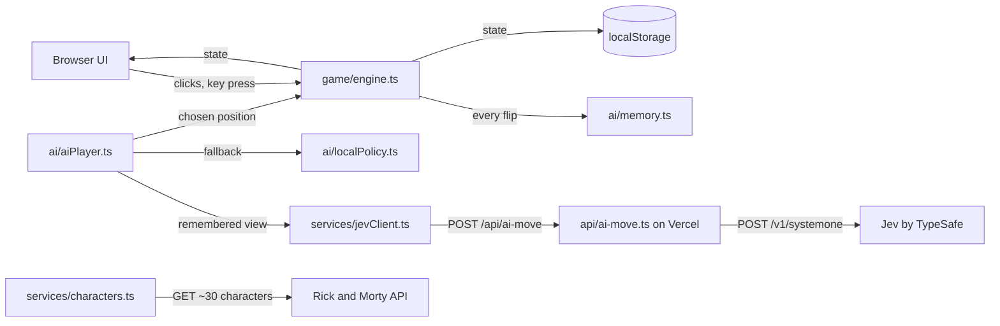

<!-- Canonical English version. Spanish copy: spec.es.md -->

# MemorIA — Technical Spec

## How This Works, In Plain Language

MemorIA is a web page built with **Vite + TypeScript**. Almost everything runs in the player's browser: the board, the turns, the dice, the scoreboard, and the AI's **imperfect memory**.

The AI opponent has two halves:

1. **The memory (our code, the kernel).** Every time any card is flipped, the AI "sees" it, but it only *remembers* it with a probability that depends on the level: low at level 1, almost certain at level 5. This is plain TypeScript with a seeded random number generator, so it can be tested and replayed exactly.
2. **The decision (Jev).** On its turn, the AI sends **only what it remembers** plus the list of face-down positions to **Jev**, a typed-decision AI model from TypeSafe, and asks: "which card should I flip?" Jev answers with a position, a probability for every option, and a confidence score. Jev never sees the real board, so it can't cheat: a forgetful level-1 memory still produces a forgetful level-1 AI.

Jev needs a secret API key, and a secret can't live in a browser page (anyone could read it). So there is one tiny **server function** on Vercel (`api/ai-move.ts`) that holds the key, forwards the question to Jev, and returns the answer. If Jev is slow, fails, answers something invalid, or isn't confident, a **local rules player** picks the move instead, so the game never freezes.

Card images come live from the **Rick and Morty API**: one request fetches a curated pool of about 30 characters. Each level draws its characters at random from that pool (a new game or restart uses a new seed, so the faces vary), and the browser preloads that level's images and draws them pixelated. If that API is down, cards become retro number-and-color tiles and the game stays playable.

Progress is saved in the browser's `localStorage` (a small notepad the browser keeps for this site) after every move, so closing and reopening the tab restores the exact board.

Why this shape: one page, one small function, two outside services, and no database or accounts. It's the smallest system that proves the kernel (memory that sharpens level by level) while using a real AI model for decisions.

## The Core Journey Through the System

PRD ref: `prd.md > The Core Journey`.

1. **Open the page** → `main.ts` loads the save from `localStorage` (`services/storage.ts`) and, in parallel, fetches the character pool (`services/characters.ts`) in one request.
2. **No save** → the welcome modal (`ui/modals.ts`) asks for the name. **Save found** → skip to the saved phase with the exact board.
3. **Level starts** → `game/deck.ts` draws the level's characters at random from the pool, builds the cards (each character twice), and shuffles them with the seeded RNG. `characters.ts` preloads those images with `Promise.allSettled`. The board renders face down (`ui/board.ts`).
4. **Dice** → the player presses Space/Enter (or taps). `game/dice.ts` rolls both dice; on a tie it rolls again. The higher roll gets the first turn.
5. **Player's turn** → clicks go to `game/engine.ts`, which flips cards, checks the pair, moves matched pairs to the player's column, or starts the mismatch timer (5 s → 3 s by level). Every flip is also reported to `ai/memory.ts`, which decides whether the AI remembers that card.
6. **AI's turn** → `ai/aiPlayer.ts` builds the "what I remember" view, asks `services/jevClient.ts` (→ `/api/ai-move` → Jev) for the first card, flips it, then asks again for the second. Each answer is validated. If it fails, the local rules player (`ai/localPolicy.ts`) decides. The pointing hand (`ui/hand.ts`) moves to each chosen card before it flips. Board clicks are ignored during this phase.
7. **After every change** → the engine emits the new state, the UI re-renders, and `storage.ts` saves it.
8. **Level ends** (no cards left) → the engine compares pairs, updates the level scoreboard (ties score nothing), and the overlay shows win/loss/tie. Then the next level starts.
9. **After level 5** → the overlay shows the trophy with confetti, the robot holding the trophy, or the tie message (`ui/effects.ts`). Restart resets to level 1, 0–0, keeps the same name, and starts a new RNG seed, so the characters change.
10. **Close and return** → step 1 restores the saved state. Face-up unmatched cards flip back down, it's still the same player's turn, and dice already rolled aren't rolled again.



## Stack

| Piece | Choice | Docs |
|---|---|---|
| Language | TypeScript (strict) | https://www.typescriptlang.org/docs/ |
| Build/dev server | Vite, vanilla TS template (no UI framework) | https://vite.dev/guide/ |
| Tests | Vitest | https://vitest.dev/guide/ |
| AI decisions | Jev via `@typesafe-ai/sdk` (server side only, Node 20+) | https://docs.typesafe.ai/ · https://docs.typesafe.ai/sdk/javascript |
| Server function + hosting | Vercel Functions (`api/` folder), `vercel dev` locally | https://vercel.com/docs/functions · https://vercel.com/docs/cli/dev |
| Card images | Rick and Morty API | https://rickandmortyapi.com/documentation |
| Confetti | `canvas-confetti` | https://github.com/catdad/canvas-confetti |
| Font | "Press Start 2P" (Google Fonts), monospace fallback | https://fonts.google.com/specimen/Press+Start+2P |

- **Vite + TypeScript**: the learner's choice. No UI framework: the UI is one board, two columns, and a few modals, so direct DOM rendering from a single state object is enough.
- **Vitest instead of Jest**: accepted recommendation. Same `describe/it/expect` API, reuses Vite's config, handles TS with no extra setup.
- **Jev for the AI's move decisions**: the learner's choice, to work with a real AI model and to make reliability concrete (confidence plus fallback). Accepted tradeoff: a small server function, a network call per AI pick, and a PRD change (the AI is no longer rules-only).
- **Vercel**: accepted recommendation, because the same `api/ai-move.ts` runs locally and in production, and it gives a public link.
- **Unverified, check in the first build step:** current Vite and Vitest major versions at install time; that the learner's TypeSafe account has an active API key and credits; Jev latency per call; that Vercel's Vite preset picks up the `api/` folder as expected.

## Where It Runs and How Someone Tries It

- **Runtime:** browser (desktop, tablet, phone) plus one Node 20+ serverless function.
- **Requirements:** Node.js 20+, npm, Vercel CLI (`npm i -g vercel`), a TypeSafe API key.
- **Secrets:** `TYPESAFE_API_KEY` in `.env.local` (git-ignored; `.env.example` is committed with an empty value) and in the Vercel project's environment variables.
- **Run locally with Jev (for the demo recording):**
  ```
  npm install
  cp .env.example .env.local   # paste the TypeSafe key
  vercel dev                   # → http://localhost:3000
  ```
- **Run the UI only (no key):** `npm run dev` → http://localhost:5173. `/api/ai-move` doesn't exist there, so the AI automatically uses the local rules player. The AI brain indicator shows "Rules".
- **Force the rules player anywhere:** add `?ai=local` to the URL (useful for testing and as a demo safety net).
- **Tests:** `npm test` (Vitest, no network: Jev and the Rick and Morty API are mocked).
- **Submission:** a 1–3 min demo video (sped-up segments, levels 1 → 5) and the public GitHub repo with `devpost/scope.md`, `prd.md`, `spec.md`.
- **Optional deployment (chosen):** Vercel, done by the learner in `6-ship` (`vercel` → preview, `vercel --prod` → public link, after adding `TYPESAFE_API_KEY` in the Vercel dashboard).

## Look and Feel

Carries forward `prd.md > Look and Feel`, with Rick and Morty characters replacing ARASAAC pictograms.

- **Mood:** a '90s pixel video game, colorful and bright, with a sci-fi/portal flavor.
- **Palette (CSS variables):** pale yellow page background `#fff4b8` with navy text `#1b2150` (changed at slice 1 review), deep space `#0b0f2a` and panel `#1b2150` for cards and panels, portal green `#97ce4c` (primary, player accent), cyan `#44d9e6` (AI accent), yellow `#ffd23f` (trophy, highlights), magenta `#ff4f9a` (loss/alerts), off-white text `#f4f4f4`.
- **Type:** "Press Start 2P" for everything, small sizes, generous letter spacing. Logo reads **MemorIA** with "IA" in portal green.
- **Pixel look:** card faces are drawn by downscaling each 300×300 image into a 64×64 canvas (32×32 was too blocky at slice 1 review) and scaling it up with `image-rendering: pixelated`. Chunky 4px borders, hard drop shadows, no rounded corners or soft gradients.
- **Card back:** a pixel portal swirl in green (CSS/inline SVG).
- **Fallback tiles:** a big pixel number on a solid color from the palette, same size as a card.
- **Signature details:** pixel pointing hand (inline SVG) that glides to the card the AI flips; spinning yellow trophy (CSS 3D rotation) with `canvas-confetti`; pixel robot holding the trophy (inline SVG).
- **Motion:** snappy 150–250 ms flips; the AI's hand takes ~600 ms per move so viewers can follow it.
- **Copy:** all in English, short and playful ("Your turn!", "The AI found a pair!", "Level 3 — AI memory: sharper").
- **Credit footer:** "Character images from The Rick and Morty API (rickandmortyapi.com). Rick and Morty © Adult Swim / Warner Bros. Discovery. Non-commercial fan project."

## Components

### Game Engine (`game/engine.ts`)
A pure state machine: `(state, action) → newState`, with no DOM, no timers, and no network. Actions: `setName`, `rollDice`, `flip(position, by)`, `hideMismatch`, `nextLevel`, `restart`. Enforces the rules: only the active player can flip, a matched pair goes to the finder's column and the finder plays again, a mismatch passes the turn after the reveal time, and ties are resolved by the scoring rules.
Phases: `welcome → dice → playerTurn | aiTurn → revealMismatch → levelEnd → gameOver`.
PRD ref: `prd.md > Turns and Pairs`, `prd.md > Level Scoreboard and End of Game`, `prd.md > States and Boundaries`.

### Levels (`game/levels.ts`)
The level table as data: cards, pairs, reveal time, AI memory probability, and board columns (desktop/phone).
PRD ref: `prd.md > Levels`.

| Level | Cards | Reveal time | AI remember probability | Desktop grid | Phone grid |
|---|---|---|---|---|---|
| 1 | 12 | 5 s | 0.20 | 6×2 | 4×3 |
| 2 | 16 | 4.5 s | 0.40 | 8×2 | 4×4 |
| 3 | 20 | 4 s | 0.60 | 5×4 | 4×5 |
| 4 | 24 | 3.5 s | 0.80 | 6×4 | 4×6 |
| 5 | 28 | 3 s | 0.95 | 7×4 | 4×7 |

The probabilities are a starting proposal, tuned during the build against the kernel test (see **Verification**).

### Deck and RNG (`game/deck.ts`, `game/rng.ts`)
`rng.ts` is a small seeded generator (mulberry32). Its seed and internal state live in the game state, so a reload continues the same sequence. A new game or restart gets a fresh seed (`crypto.getRandomValues`). `deck.ts` draws N distinct characters at random from the pool for the level (N = pairs), duplicates them, and Fisher–Yates shuffles them with the RNG. If fewer pool characters loaded than needed, fallback tiles fill the gap.
PRD ref: `prd.md > Levels` ("each character appears exactly twice, shuffled"; "characters vary between games").

### Dice (`game/dice.ts`)
Rolls 1–6 for both players with the RNG and repeats on ties. Returns every roll so the UI can show a re-roll.
PRD ref: `prd.md > Dice Roll`.

### AI Memory — the Kernel (`ai/memory.ts`)
`observe(position, characterId, level, rng)`: when any card is flipped, the AI remembers `{position → characterId}` with the level's probability; otherwise it doesn't store it. Matched cards are removed from memory. The memory is part of the saved state.
PRD ref: `prd.md > The Game AI (the Kernel)`; `scope.md > The Unique Kernel`.

### Local Rules Player (`ai/localPolicy.ts`)
A deterministic-given-RNG policy that uses the same remembered view: (1) second pick: if the first card's partner is remembered, flip it; (2) first pick: if a full remembered pair exists, flip one of it; (3) otherwise flip a random face-down card the AI doesn't remember. This is both the fallback and the baseline the kernel test uses.
PRD ref: `prd.md > The Game AI (the Kernel)`.

### AI Player (`ai/aiPlayer.ts`)
Orchestrates one AI pick. It builds the view (face-down positions, which of them it remembers and as whom, and the first pick if any) and calls Jev through `jevClient`. It accepts the answer only if the position is face down and not already picked this turn, and the confidence is ≥ 0.5. Otherwise it uses `localPolicy`. It records `source: "jev" | "rules"` and the confidence for the AI brain indicator. `?ai=local` skips Jev.
PRD ref: `prd.md > The Game AI (the Kernel)`, `prd.md > Turns and Pairs`.

### Jev Client (`services/jevClient.ts`)
`POST /api/ai-move` with a 3 s timeout (`AbortController`). It returns `{ position, confidence }` or throws, and the AI Player catches the error and falls back.

### Server Function (`api/ai-move.ts`)
A Vercel function that validates the request body, turns it into one Jev `choice` question, calls `client.systemOne`, and returns the chosen position and confidence. It reads `TYPESAFE_API_KEY` from the environment. The question builder is an exported pure function so Vitest can test it without the network. See **External Services** for the contract.

### Characters (`services/characters.ts`)
Holds the curated pool of ~30 character IDs, fetches them in one request on page load, and, when a level starts, preloads that level's images with `Promise.allSettled`. Returns `{ id, name, image | null }` for each character; `null` means fallback tile. Nothing is stored in the repo or `localStorage` except the IDs.
PRD ref: `prd.md > Look and Feel`.

### Storage (`services/storage.ts`)
Saves the full state as JSON under `memoria:save:v1` after every change. On load, it checks the version and shape; anything corrupt or from an old version starts fresh. Every read and write is wrapped in try/catch (private mode can block storage).
PRD ref: `prd.md > Resume Where You Left Off`.

### UI (`ui/`)
Renders from the state; it holds no game rules.
- `modals.ts`: welcome (name required plus instructions), phone player-details modal, and result overlays. PRD ref: `prd.md > Welcome and Instructions`, `prd.md > Screens and Layout`.
- `board.ts`: the grid, flip animation, and click/tap handling (ignored unless it's the player's turn). Uses `pixelate.ts` to draw faces.
- `columns.ts`: the player/AI columns (name, pairs this level, levels won), the level indicator, the level scoreboard, and the AI brain indicator ("AI brain: Jev 82%" or "AI brain: Rules"). On phone: names and level wins on top, tap to open details.
- `dice.ts`: the dice display, Space/Enter/tap to roll, and the re-roll animation.
- `hand.ts`: the turn pointer; during the AI's turn it glides to each chosen card before the flip.
- `effects.ts`: the trophy with confetti, the robot with the trophy, and the tie message.
- `pixelate.ts`: image → 64×64 canvas → scaled up, or the fallback tile.

### Timers and Turn Loop (`main.ts`)
The only place with `setTimeout`. It starts the mismatch timer (reveal time → `hideMismatch`), runs the AI's turn step by step (think → hand move → flip → repeat), and wires engine → render → save. Keeping timers out of the engine keeps the engine testable.

## Data Model

```ts
type Player = "human" | "ai";

interface Card { position: number; characterId: number; state: "down" | "up" | "matched"; matchedBy?: Player }

interface GameState {
  version: 1;
  phase: "welcome" | "dice" | "playerTurn" | "aiTurn" | "revealMismatch" | "levelEnd" | "gameOver";
  name: string;
  level: 1 | 2 | 3 | 4 | 5;
  cards: Card[];
  flipped: number[];                     // positions face up this turn (0–2)
  pairs: { human: number[]; ai: number[] };  // characterIds collected this level
  levelWins: { human: number; ai: number };
  lastLevelResult?: Player | "tie";
  dice?: { rolls: Array<{ human: number; ai: number }>; starter: Player };
  turn: Player;
  aiMemory: Record<number, number>;      // position → characterId the AI remembers
  rng: { seed: number; state: number };
}
```

| Data | Lives in | Updated when | Leave and come back |
|---|---|---|---|
| Whole `GameState` | memory + `localStorage` (`memoria:save:v1`) | after every engine action | restored exactly; `flipped` unmatched cards turn back down; `revealMismatch` resumes as the next player's turn |
| AI memory | inside `GameState` | on every flip (probabilistic) and on every match (removed) | restored, so the AI doesn't "reset" |
| Character pool (names, image URLs) | memory only | fetched on every page load | re-fetched; cards keep their `characterId`, so the resumed board shows the same faces |
| AI brain indicator | memory only | each AI pick | shows nothing until the next AI pick |

## File Structure

```
project-x/
├── api/
│   └── ai-move.ts           # Vercel function: holds the key, builds the Jev question, returns {position, confidence}
├── src/
│   ├── main.ts              # bootstrap, turn loop, timers, engine → render → save wiring
│   ├── game/
│   │   ├── types.ts         # GameState, Card, actions
│   │   ├── levels.ts        # level table (cards, reveal time, memory probability, grids)
│   │   ├── rng.ts           # seeded RNG (mulberry32)
│   │   ├── deck.ts          # build + shuffle a level's cards
│   │   ├── dice.ts          # rolls with tie re-roll
│   │   ├── engine.ts        # pure state machine: all game rules
│   │   └── *.test.ts        # unit tests next to each module
│   ├── ai/
│   │   ├── memory.ts        # the kernel: probabilistic remembering
│   │   ├── localPolicy.ts   # rules player (fallback + test baseline)
│   │   ├── aiPlayer.ts      # view → Jev → validate → fallback
│   │   └── *.test.ts        # incl. kernel.test.ts (level 1 vs level 5 simulation)
│   ├── services/
│   │   ├── characters.ts    # character pool, Rick and Morty fetch, per-level image preload (allSettled)
│   │   ├── jevClient.ts     # POST /api/ai-move with timeout
│   │   ├── storage.ts       # localStorage save/load/validate
│   │   └── *.test.ts
│   ├── ui/
│   │   ├── board.ts  columns.ts  modals.ts  dice.ts  hand.ts  effects.ts  pixelate.ts
│   │   └── sprites.ts       # inline SVG: hand, trophy, robot, card back
│   └── styles/
│       └── main.css         # palette variables, pixel styles, responsive grids
├── index.html               # single page, font link, credit footer
├── vite.config.ts           # Vite + Vitest config (jsdom only for UI tests)
├── tsconfig.json
├── package.json             # scripts: dev (vite), dev:full (vercel dev), test, build
├── .env.example             # TYPESAFE_API_KEY=
├── .gitignore               # already ignores .env* and learner-profile.md
├── README.md                # what it is, how to run, credits
└── devpost/                 # planning docs
```

## External Services and Dependencies

### Jev by TypeSafe
- **Called from:** `api/ai-move.ts` only (server side).
- **Endpoint:** `POST https://api.typesafe.ai/v1/systemone`, `Authorization: Bearer $TYPESAFE_API_KEY`, via `@typesafe-ai/sdk` (`new TypeSafeClient()` reads the env var).
- **Our function's contract (browser → `/api/ai-move`):**
  ```json
  { "level": 3,
    "firstPick": { "position": 7, "characterId": 2 } | null,
    "candidates": [ { "position": 0, "remembered": 1 }, { "position": 4, "remembered": null } ] }
  ```
  Response `200`: `{ "position": 4, "confidence": 0.82 }`. Error → `4xx/5xx` with `{ "error": "..." }`.
- **Question sent to Jev (one `choice`):**
  ```ts
  client.systemOne({
    state: { goal: "memory card game: flip the card most likely to complete a pair",
             firstPick, candidates },
    questions: {
      move: choice("Which face-down card should the AI flip now?", {
        pos_4: "unknown card",
        pos_0: "remembered: character 1 (partner of first pick)", /* one option per candidate */
      }),
    },
  });
  // → answers.move = { choice: "pos_0", probabilities: {...}, confidence: 0.82 }
  ```
- **Cost:** ~US$42 per billion input tokens (from typesafe.ai). Negligible here.
- **Unverified:** rate limits, typical latency, whether the account has credits. Check in build step 1.
- Docs: https://docs.typesafe.ai/introduction/quickstart · https://docs.typesafe.ai/primitives/choice · https://docs.typesafe.ai/confidence

### Rick and Morty API
- **Called from:** the browser (`services/characters.ts`). No key.
- **Call:** `GET https://rickandmortyapi.com/api/character/{id1,id2,...,id30}` → array of `{ id, name, image, ... }`; images are 300×300 JPEGs.
- **Character pool:** ~30 recognizable characters with distinct looks (Rick, Morty, Summer, Beth, Jerry, and others). The exact IDs are confirmed against the API in the build.
- **Rate limits:** none documented. **Cost:** free.
- **Copyright:** the images are © Adult Swim / Warner Bros. Discovery. The game shows them live from the source, never stores them in the repo, and credits them in the footer.
- Docs: https://rickandmortyapi.com/documentation

### Vercel
- Hosts the static build and `api/ai-move.ts`. Free Hobby plan. The key goes in Project → Settings → Environment Variables.
- Docs: https://vercel.com/docs/functions · https://vercel.com/docs/cli/dev

## Important Failure Modes

- **Jev slow, down, invalid answer, or low confidence** → the local rules player makes that pick. The game continues, and the AI brain indicator shows "Rules".
- **Rick and Morty API down or an image fails** → retro number-and-color tiles for the missing characters. The pairs still match by `characterId`.
- **`localStorage` blocked, corrupt, or old version** → start fresh with the welcome modal. No crash.
- **Level 5 on a small phone** → a 4×7 grid with cards sized by viewport width (`min()` in CSS). No horizontal scroll, checked at 360 px wide.

## Verification

Implements the learner's reliability goal (`learner-profile.md > Desired Learning Outcome`).

- **Unit tests (Vitest)** for every module in `game/`, `ai/`, `services/`, with a fixed seed so results are reproducible. `fetch` is mocked.
- **Kernel test** (`ai/kernel.test.ts`): simulate 500 AI-only games per level with the local policy. Assert that the average number of "missed known pairs" (the AI flips a card whose partner it has already seen, then misses) at level 1 is at least 3× the level 5 value, and that at level 5 known pairs are taken ≥ 90% of the time. This test is how the probabilities in **Levels** get tuned.
- **Resume test:** save mid-turn, reload, and compare the board.
- **Variety test:** two different seeds produce different level-1 character sets, and the same seed produces the same set.
- **Function test:** the question builder and body validation in `api/ai-move.ts`, with the SDK mocked.
- **Manual checks per build step:** in the browser at desktop width and at 360 px, with `vercel dev` (Jev) and with `?ai=local`.

## What Was Simplified and Why

- **Jev decides only the move; the memory stays local**, instead of asking a model to "play memory". This keeps the kernel ours, testable, and visible, and Jev can't cheat. The fuller version would let the model manage its own memory, which is not testable and could erase the level difference.
- **One server function, no database**, instead of a backend with saved games. Progress lives in the browser, as `prd.md > States and Boundaries` requires.
- **Live images with fallback tiles**, instead of stored or bundled images. This avoids redistributing copyrighted files and keeps the repo clean. It needs the network, and offline play was already deferred.
- **Vanilla DOM rendering, no framework.** The UI is small, and a framework would add concepts without proving anything.

## Decisions and Open Issues

**Learner decisions**
- Vite + TypeScript. Vitest (accepted recommendation over Jest).
- Use **Jev** for the AI's move choices, with the local memory as the filter and a rules fallback. The learner accepted the server function, the per-pick network call, and the PRD change.
- Public link on **Vercel**. The learner deploys in `6-ship`.
- **Rick and Morty characters instead of ARASAAC pictograms.** This reverses `scope.md > Explicitly Cut` after the copyright risk (public repo and video, prize competition) was explained. The learner accepted the risk. Images are fetched live, not stored.
- Fallback retro number-and-color tiles when the character API fails.
- **Characters vary between games** (added at review): each level draws its characters at random from a ~30 character pool, and a new game or restart uses a new seed.

**Derived implementation details** (from the decisions above, open to change): seeded RNG; the memory probabilities 0.20 → 0.95; the 3 s Jev timeout; the 0.5 confidence threshold; `?ai=local`; the palette and "Press Start 2P" font; the grid sizes.

**Proposed for review:** a small "AI brain" indicator in the AI column (Jev plus confidence, or Rules). It makes the real AI visible in the video and makes the fallback observable. Cut it if unwanted.

**Useful unknown**
- *Question:* "Should I load the characters with `Promise.all`, or is there a better way?"
- *What clarified it:* the API accepts several IDs in one URL, so the data takes a single `fetch`. The images are separate downloads, and they use `Promise.allSettled`, because `Promise.all` rejects the whole batch if one image fails. `allSettled` reports each image, so only the failed ones become fallback tiles. It's checked by a `characters.test.ts` case where one image fails.

**To verify early in the build**
- TypeSafe account access, API key, credits, and latency (one real `systemOne` call).
- The ~30 character IDs and names in the pool.
- Vite/Vitest versions, and that `vercel dev` serves `api/ai-move.ts` with the Vite preset.

**Carried from `prd.md > Open Questions`**
- The exact AI memory probabilities per level: the starting values are in **Levels**, tuned by the kernel test.

**Doc updates made alongside this spec**
- `scope.md` and `prd.md` (and their `.es.md` copies) updated: Rick and Morty images instead of ARASAAC, characters vary between games, cartoon characters no longer cut, Jev as the AI's decision model (replacing "no language model / rules only"), and the credit line.
